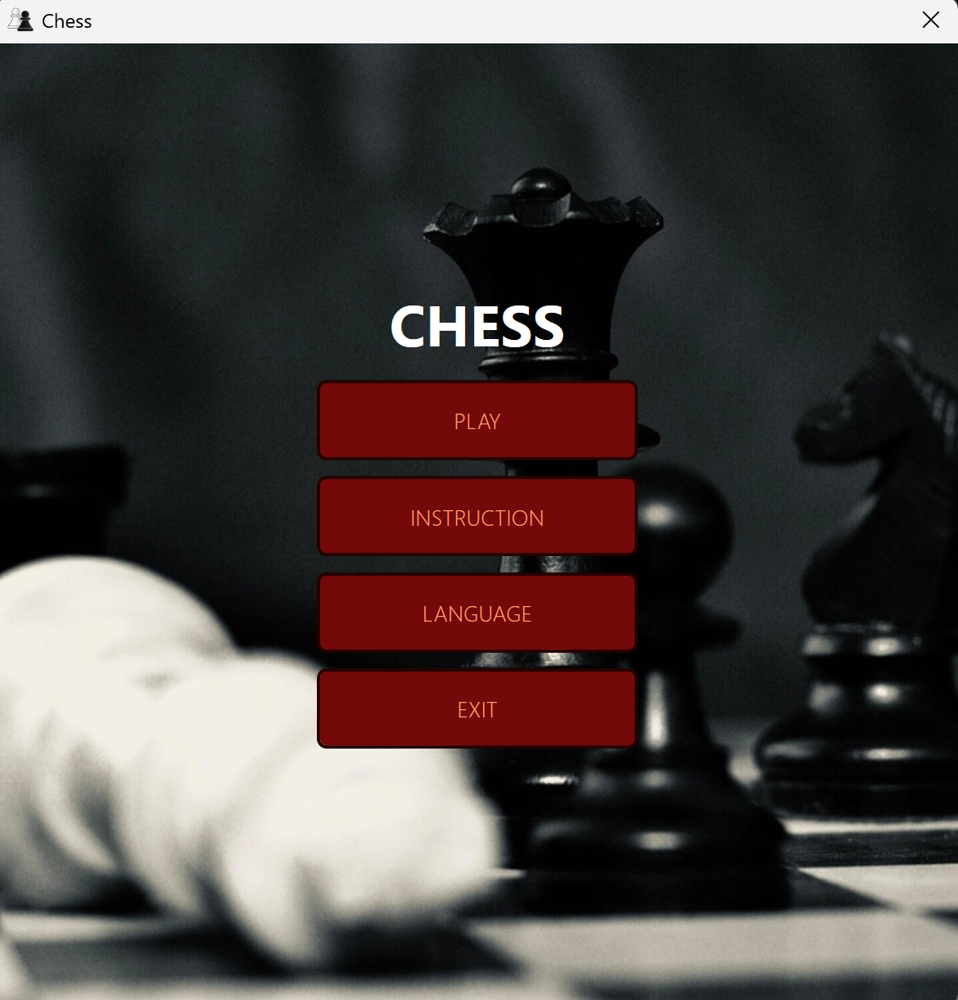
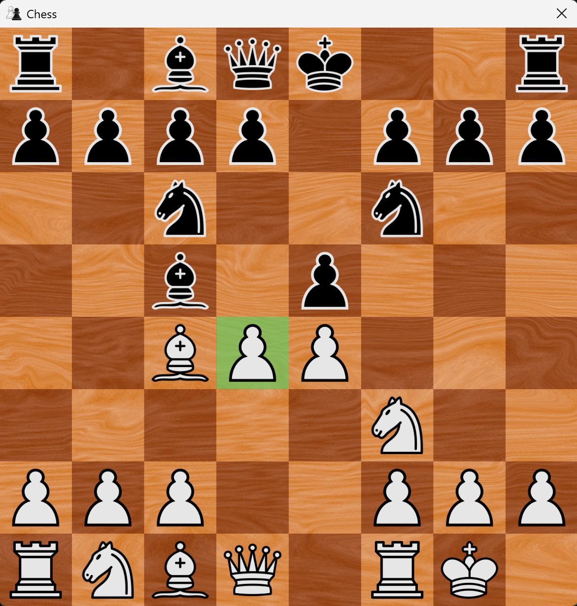

# Chess Game

一款由 C# 开发的国际象棋游戏，开发环境为Visual Studio 2022
 
支持本地双人对战，未来可能加上人机对战模式

### 游戏特点

- 轮到白方/黑方着棋时，鼠标相应切换为白色/黑色
- 落子前允许落子的位置有荧光高亮
- 支持 English -> 中文 -> Русский 语言切换
- 主菜单循环播放背景音乐
- 落子、吃子、易位、升变有具体音效
  
### 游戏截图

  
   
  <strong>游戏主菜单</strong>
    
  
   
  <strong>棋局</strong>
    

  
